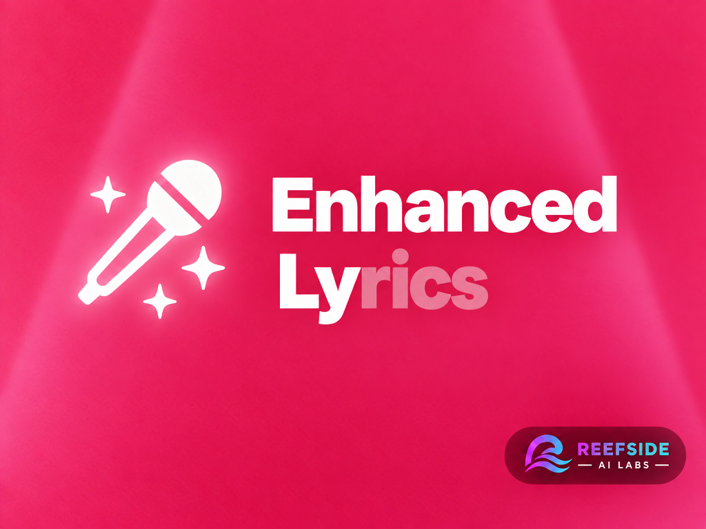

<p align="center">
    
</p>

# Enhanced Lyrics for Jellyfin

A Jellyfin **12.1 / .NET 10** plugin that replaces local lyric discovery and the server-hosted Jellyfin Web lyrics view. Based on [jellyfin-plugin-template](https://github.com/jellyfin/jellyfin-plugin-template).

- TTML parsing and validation with [TtmlLyricParser 0.2.0](https://www.nuget.org/packages/TtmlLyricParser).
- Enhanced LRC word timing, ordinary LRC, and plain-text sidecars.
- [Braccato](https://github.com/better-lyrics/braccato) progressive word highlighting, smooth scrolling, click-to-seek, and instrumental indicators.
- [Kawarp](https://github.com/better-lyrics/kawarp) animated album-art backgrounds, with static fallback and reduced-motion support.
- Desktop and mobile browser layouts, expandable lyrics, and playback controls.
- Compatible line lyrics and word cues through Jellyfin's existing API for other clients.

## Try it with Docker

The Dockerfile extends **`jellyfin/jellyfin:latest`**, builds both components, installs the plugin, and uses its automatic Web integration. The target remains 12.1; future `latest` releases must be checked before use.

```sh
python3 scripts/create-test-media.py
docker compose up --build -d
python3 scripts/smoke-test.py
```

Open **http://localhost:8098/web/**. The smoke test completes the initial setup, creates a music library, and verifies the rich and standard lyric APIs. Its randomly generated test credentials are in `.test-data/test-account.json` (ignored by Git). Play **Synthetic** for TTML, **Enhanced LRC** for ELRC, or **Fallback** for invalid-TTML fallback, then open Jellyfin's normal Lyrics entry point.

This instance uses isolated `.test-data/config`, `.test-data/cache`, and `.test-data/media` directories and binds to localhost. It does not use another Jellyfin instance's libraries or configuration.

```sh
docker compose down
```

## Build and install

Requires .NET 10, Node 24 or newer, Python 3, and `zip`.

```sh
./scripts/build.sh
```

The distributable is `artifacts/enhanced-lyrics-0.2.0.zip`. Copy **both** DLLs from `artifacts/EnhancedLyrics/` to a new directory beneath Jellyfin's `plugins` directory, then restart Jellyfin. Web assets are embedded in the plugin DLL; do not copy Jellyfin runtime assemblies into the plugin directory.

The plugin automatically inserts its loader into server-hosted Web responses. Install, restart Jellyfin, and reload the browser. It does not edit Web files or require a custom Docker image. If upgrading from a manually patched installation, remove the old tag once with `python3 scripts/integrate-web.py /path/to/jellyfin-web --remove`; future Web updates require no patching.

The loader assumes Jellyfin Web is served by its Jellyfin server at `/web/` (including a configured base URL such as `/jellyfin/web/`). Separately hosted Web clients need a different asset bootstrap and are outside this release's supported installation.

In the plugin's dashboard configuration, enable/disable Enhanced Lyrics and animated backgrounds. Disabling the plugin restores the built-in view within five seconds. Disabling stops loader injection into subsequent page loads. Removing the plugin requires a server restart and restores stock Web responses automatically.

The example Docker image copies the plugin into `/config/plugins` at each startup. To uninstall from that setup, use the stock image and remove the two plugin DLLs from that instance's configuration directory.

## Publishing releases

Publish a GitHub release with a tag such as `v0.2.0` or `v0.2.0.0` to run
`.github/workflows/publish.yaml`. Tags must have three or four numeric components,
with an optional `v` prefix. The tag supplies the package and assembly version;
update the compatibility metadata and changelog in `build.yaml` before tagging.

The workflow builds the embedded Web assets, runs the tests, and uploads a
Jellyfin-installable `enhanced-lyrics_<version>.zip` and `manifest.json` to the
release. This ZIP has both DLLs at its root, unlike the manual installation bundle
from `scripts/build.sh`. After upload succeeds, it sends a `plugin-release`
notification to `reefside-ai-labs/jellyfin-plugin-repo`, which imports stable
releases and commits the updated catalog. Drafts and prereleases are excluded
from the catalog. To retry packaging or notification, run **Actions → Publish
plugin → Run workflow** with the existing release tag.

The publishing repository needs the Actions secret `PLUGIN_REPO_APP_CLIENT_ID`
and secret `PLUGIN_REPO_APP_PRIVATE_KEY`. These belong to a GitHub App installed
on `reefside-ai-labs/jellyfin-plugin-repo` with **Contents: read and write**.
The catalog also needs this plugin's repository and GUID registered in its
`plugins.json`; its weekly polling is a fallback for missed notifications.

Add the catalog to Jellyfin under **Dashboard → Plugins → Repositories**:

```text
https://raw.githubusercontent.com/reefside-ai-labs/jellyfin-plugin-repo/main/manifest.json
```

Catalog installation installs the server plugin and embedded assets. Restart Jellyfin and reload Web to activate automatic integration.

## Sidecars and selection

For `Song.flac`, supported names include:

```text
Song.ttml
Song.elrc
Song.lrc
Song.txt
Song.en.ttml
Song.en-US.elrc
Song.fr.lrc
```

Selection ranks an exact preferred language first, then its base-language match, then an unlabelled file, then other languages. Within each group it prefers **TTML → ELRC → LRC → text**. The Web view uses the user's audio-language preference, falling back to the browser language. Standard API reads use the same user preference, falling back to `Accept-Language`.

Only matching files in the track's directory are considered. Symlink sidecars and files larger than 4 MiB are skipped. Invalid files produce server diagnostics and fall back to the next candidate. Discovery and playback never rewrite source files.

Enhanced LRC example:

```lrc
[00:02.000]<00:02.000>Hello <00:03.000>Jellyfin<00:06.000>
```

The final empty time tag ends the previous word. Two- and three-digit fractional seconds, repeated line timestamps, and LRC metadata tags are supported. Positive `[offset:200]` displays lyrics 200 ms earlier; offsets are applied once to both line and word times. Ordinary LRC retains line timing without inventing word timings. Instrumental gaps are inferred only from known line boundaries and track duration; five seconds is the minimum gap.

TTML timing follows the parser's automatic standard/Apple dialect detection. Standard TTML times are parent-relative; Apple lyric timestamps are absolute when marked as Apple lyrics. Timed spans, background flags, singer IDs, roles, language, line keys, translation/transliteration XML payloads, and original source XML are preserved. Embedded translations and romanization display below the original lyric. Choose an available translation language (or Off) and toggle Romanization in the lyric view; preferences are remembered in this browser. Authored timed romanization highlights word by word, while plain romanization and translations display as text rows. Braccato's TTML metadata parser matches variants using explicit `for` references to lyric keys. No translation service or Apple Music access is required. Dedicated duet controls, online sourcing, and editing tools are deferred.

## How integration works

An ASP.NET startup filter inserts the loader before Jellyfin boot scripts in `/web/` and `/web/index.html` responses, including configured base URLs. The stock Web directory can stay read-only. Transformed HTML uses `Cache-Control: no-store`; HEAD returns matching metadata, and conditional/range requests receive the complete transformed page. Other routes pass through unchanged.

The plugin decorates `ILyricManager` for local reads and provides a high-priority `ILyricParser`. It preserves Jellyfin's provider, upload, download, and delete implementations. It does not create conflicting replacements for core controller routes. TTML sidecars are discovered by the plugin because Jellyfin's built-in scanner does not recognize their extension.

- `GET /Audio/{itemId}/Lyrics`: existing authorized Jellyfin endpoint; returns compatible lines and cues using **ticks**.
- `GET /EnhancedLyrics/Audio/{itemId}?language=en`: authorized rich data using **milliseconds**. Uses Jellyfin's user-aware item lookup; does not accept arbitrary file paths.
- `GET /EnhancedLyrics/Status`: public feature flags, without library data.
- `GET /EnhancedLyrics/Assets/enhanced-lyrics.js` and `.css`: public embedded static assets.

Jellyfin 12.1 does not expose its playback manager as a browser global. The early loader observes webpack registration and captures the existing manager when its module executes. It does not execute unrelated modules. The renderer reads the active local media clock every animation frame for smooth word highlighting, preserving Jellyfin's transcoding offset. Remote players retain Jellyfin's reported clock. Seek/play controls and player changes continue through Jellyfin's playback manager. This is a version-specific integration seam: if it cannot find the manager or load lyrics, it leaves the original view available and reports `[Enhanced Lyrics]` diagnostics in the browser console. The dashboard also reports whether the bridge connected.

The original lyric container stays mounted while the replacement is active, and is restored on failure or disable. Pending requests are cancelled on track/view changes, and renderer, resize observer, and WebGL resources are released when the view closes.

## Verification

```sh
dotnet test Jellyfin.Plugin.EnhancedLyrics.slnx -c Release
npm --prefix web ci
npm --prefix web test
python3 -m unittest discover -s tests -p 'test_*.py'
python3 scripts/smoke-test.py  # with the isolated compose instance running
```

Tests cover TTML relative/Apple timing, cue character ranges, ELRC offsets and repeated timestamps, malformed input and XML entity rejection, language/format priority, fallback, size/symlink limits, cancellation, rich-to-renderer conversion, webpack registration, and reversible loader installation. Synthetic fixtures contain original test text and generated audio.

The [cold-install acceptance test](docs/loader-acceptance.md) installs a catalog package into stock, read-only Jellyfin Docker, uses a fresh browser with caches cleared and disabled, checks real playback, and repeats after destroying and recreating the container. Build and publish workflows gate packages on this test.

License: GPL-3.0, inherited from the Jellyfin plugin template. See `THIRD-PARTY-NOTICES.md` for bundled MIT libraries.
